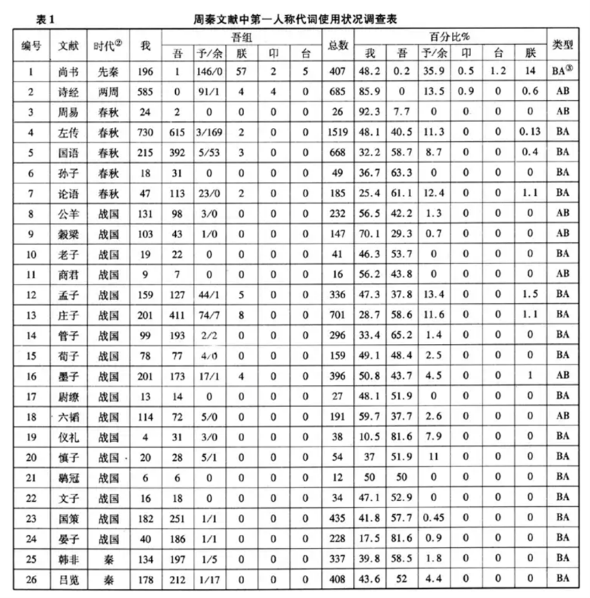

## 引言

《齐物论》作为《庄子》内篇的核心章节，被冯友兰称为“庄之所以为庄者”，其中“吾丧我”一句尤为引人注目, James Legge将其翻译为“I had just now lost myself”。传统解读常将“吾”视为高层次的自我，“我”视为低层次的自我，但本文试图重新解读“吾丧我”，提出一种新颖的观点：即“吾”代表外在的、受社会构建的自我，而“我”代表内在的、真实的自我，“吾丧我”因此“对于自己在俗世中展现出来的外表，已经丧失了真正的自己”。

## 从“今者”的概念谈起

颜成子游立侍乎前，曰：“何居乎？形固可使如槁木，而心固可使如死灰乎？今之隐几者，非昔之隐几者也。”子綦曰：“偃，不亦善乎而问之也！今者吾丧我，汝知之乎？女闻人籁而未闻地籁，女闻地籁而未闻天籁夫！”

“形固可使如槁木，而心固可使如死灰乎？”一句，意为“形本来就……，而心本来就……吗？”这样的问法实际上是在暗示“形本来不……，而心本来不……”，进而可以知道，提问的话题应该是“是什么让你的形……，而心……？”因此，“吾丧我”作为回答，应该是强调“吾”在当下这个时刻的状态是“丧我”，进而导致了“吾”此时形如槁木而心如死灰。“吾丧我”不是对过去这段时间以来“吾”状态的表述，因此，探讨“吾丧我”的真正含义才有意义，否则“吾丧我”就可以有以下两种解释：

吾是希望丧我的，“这段时间以来吾丧我，所以我现在……”；

吾是不希望丧我的，“这段时间以来吾丧我，我未来应当……”。

无论“吾“和“我”孰为高下，其本质都是一样的。当然，这里仅是从文法角度证明，“今者”的概念必然是瞬时而非持续的。结合后文，显然“吾丧我”是好的。

“今者”的瞬时性使“吾丧我”成为了一种不可驻留的存在状态，可以证明“吾丧我”既非主动追求，也非被动丧失，而是当下的自然呈现，是摒弃人为的存在。它是一种无目的性的、自发的状态，不可强求，只可自然显现，“夫吹万不同，而使其自已1也，咸其自取，怒者其谁邪”，恰如后文所提到的“天籁”。反过来想，如果“吾”真的在追求“丧我”，那“吾”就必然不可能“丧我”。

## “吾”“我”高下之争

诚然，“吾”常常作主语和定语，但单纯认为“吾丧我”中主语用“吾”是一种语法现象，笔者认为并不合理，因为“我”显然也可作主语。不必舍近求远，就《齐物论》这篇而言，下文就出现了“既使我与若辩矣，若胜我，我不若胜，若果是也？我果非也邪？我胜若，若不吾胜，我果是也？而果非也邪？”和“我与若与人俱不能相知。”，这种“我”作主语的情况。庄子用“吾丧我”而非“我丧我”（或者“我丧吾”，但“吾”几乎只在否定句的宾语前置中才作宾语）必然是认为“吾”和“我”存在某种程度的差异。林希逸注意到了这一点，“吾即我也，不曰我丧我，而曰吾丧我，言人身中才有一毫私心未化，则吾我之间亦有分别矣。吾丧我三字下得极好。”[[1\]](#_ftn1)但他认为“吾即我也”，“言人身中才有一毫私心未化”，认为“吾”与“我”词义上并无不同，笔者认为是有待商榷的。但认为“吾”“我”存在差别的解庄者，都秉持一种观念，“吾”是高于“我”的存在[[2\]](#_ftn2)，这也并不尽然。

《说文解字》云：“（吾）我自称也。”[[3\]](#_ftn3)但问题在于“我自称也”这短短四个字，却可以解读为“我，自称也”或“我（之）自称也”。若按照前者解释，“吾”就只是和“我”一样的简单第一人称代词，汤可敬解读为“吾，我，是自己对自己的称呼”[[4\]](#_ftn4)。但按照后者解释，“吾”就是在自称时所用的“我”，是被言说出来的“我”。笔者认为后者解读合理，“吾”“从口”，形声字，口为形旁，证明“吾”是言说的对象，这恰恰与“吾”往往用作主语和定语的语法功能吻合。林凯、苏煜文认为“吾”作为单纯自称，没有将自身与他者关联而进行自我确认，没有将自我进行对象化[[5\]](#_ftn5)，这种说法是比较有道理的。“吾”是外在的、被社会构建的言说的自我，而“我”是更本真的自我。

从音韵的角度考虑，一些学者提出“吾”“我”体现了上古汉语是屈折语[[6\]](#_ftn6)。但笔者认为这是片面的。屈折语对虚词的需求极小，但汉语显然存在着大量的虚词。我们引入“卬”字，“卬”在西周语料中只有四处，作主语和定语，这与“吾”的语法功能是一致的[[7\]](#_ftn7)。而“吾”与“卬”同属鱼部，笔者认为这是人们在进行文学创作时因缺少一个鱼部的第一人称代词用于押韵而引入的（“我”为歌部）。王力说“如果说毫无分别得两个人称代词在一种语言中（口语中）同时存在，并且经常同时出现，那是不能想象的”。观察王力列出的第一人称代词使用状况表，“吾”被大规模使用后“卬”便销声匿迹。尽管证明“吾”是“卬”得出的产物的证据并不充分，“吾”最终以各种方式取代了“卬”却是比较可靠的。洪波认为“吾”“卬”是周语与殷语的融合过程由周语进入汉语的。[[8\]](#_ftn8) “吾”是为了语言表达目的而引入的专门化的“我”，这与训诂得出的结论是一致的。

## “吾丧我”新论

由以上我们可以知道，“吾”是为了言说而特化的“我”，那么“吾”的层次（或者说内容含量），就一定低于“我”，“吾”并非高于“我”的存在，这与绝大多数研究的结论并不一致。“吾”是外在的、被社会构建的言说的自我，而“我”是更本真的自我。“吾丧我”或许需要解释“对于自己在俗世中展现出来的外表，已经丧失了真正的自己”。李泽厚认为，庄子对于一切技术、一切文明的态度是回到“当是时也”，“山无蹊隧，泽无舟梁……同与禽兽居，族与万物并……”，他要求否定一切文明与文化，回到无目的、无意识的状态[[9\]](#_ftn9)。一切人为，一切人的有意识有目的活动、认识、思虑、打算，都是对“道”的损伤。中国人民大学历史学院王尔老师在2024秋季学期《中国古代思想史》课程上这样介绍庄子:“生活的意义，不在于它想成为什么，而在它想摆脱什么。庄子要舍弃的不是许多东西，而是所有东西。”如果是内在（或高层次）的“吾”抛弃了外在（或低层次）的“我”，自我产生的想法不再适应不得不展现出的外表，这是不够彻底的，因为这是进步，但庄子的理想境地是彻头彻尾的倒退，所以这算不上抛弃了一切。况且如前所言，如果追求抛弃低层次的“我”，那就根本无法达到“丧我”的境界。齐物论作为“庄之所以为庄者”（冯友兰语），“吾丧我”如果解释为，展现在俗世的外表的“吾”已经不能体现内心的“我”产生的想法，或许更加合理，这样的生存论才契合庄子化有为无的本体论，才是庄子想要的真正的抛弃一切。

------

[[1\]](#_ftnref1) （宋）林希逸，《钦定四库全书》本《庄子口义》卷一，内篇齐物论第二，可透过“中国哲学书电子化计划”网站查询：https://ctext.org/library.pl?if=gb&file=1932&page=46&remap=gb

[[2\]](#_ftnref2) 朱玉婷.互文性视域下庄子“吾丧我”阐释——以《庄子》内篇为核心[J].管子学刊,2024,(01):19-30.DOI:10.19321/j.cnki.gzxk.issn1002-3828.2024.01.02.

[[3\]](#_ftnref3) （东汉）许慎，《说文解字》卷三口部，可透过“中国哲学书电子化计划”网站查询：https://ctext.org/dictionary.pl?if=gb&id=27020&remap=gb

[[4\]](#_ftnref4) 汤可敬《说文解字今释》，上海古籍出版社，2018

[[5\]](#_ftnref5) 林凯,苏煜文.“吾丧我”义辨[J].老子学刊,2024,(01):139-155.

[[6\]](#_ftnref6) 高本汉《原始中国语为变化语说》

[[7\]](#_ftnref7) 陈超.先秦汉语第一人称代词研究综述[D].东北师范大学,2014.

[[8\]](#_ftnref8) 陈超引. 洪波.周秦汉语第一人称代词“吾”“卬”的来源及其与“余（予）”“我”“朕”的功能分别[C].见：汉语历史语法研究.北京：商务印书馆.2010.20.

[[9\]](#_ftnref9) 李泽厚《中国古代思想史论》，《庄禅玄宗漫述》
