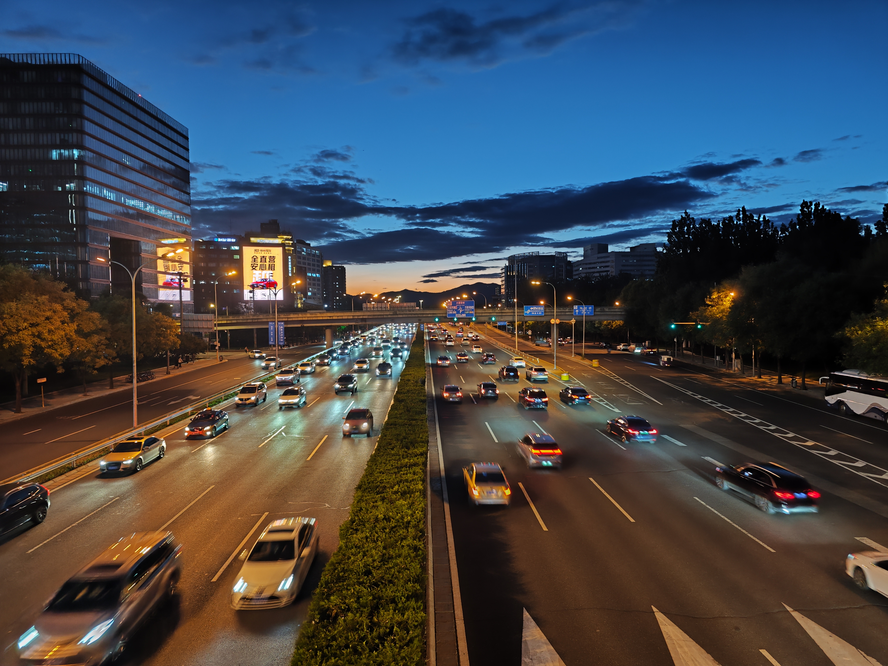
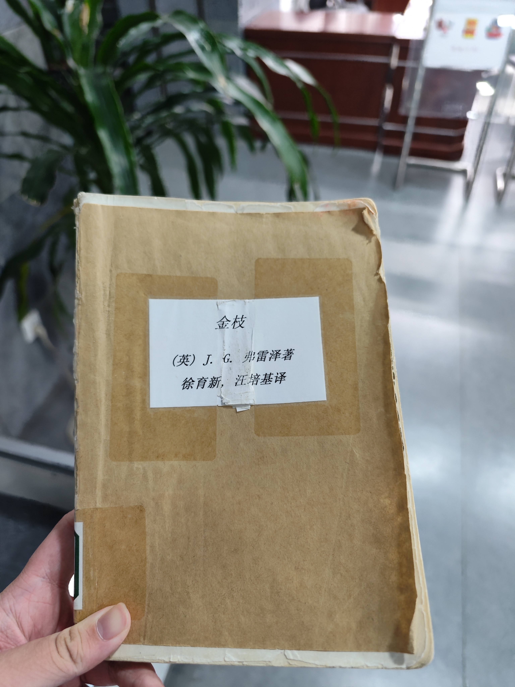
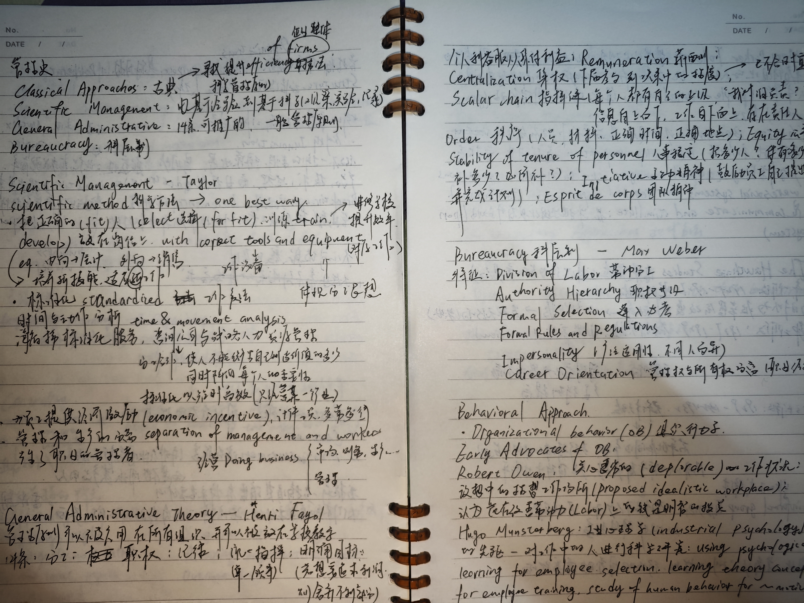
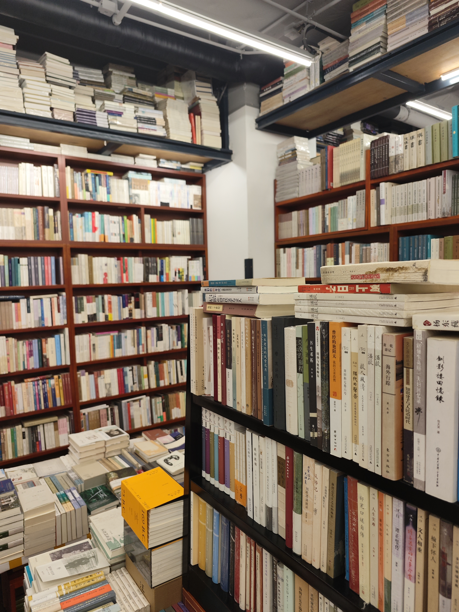
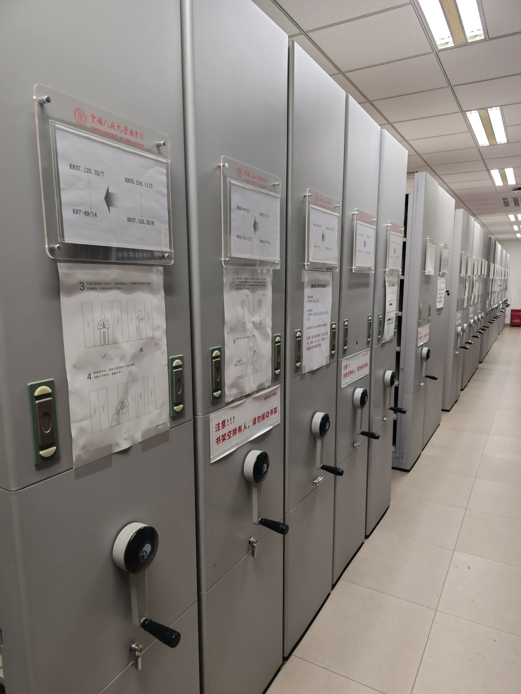
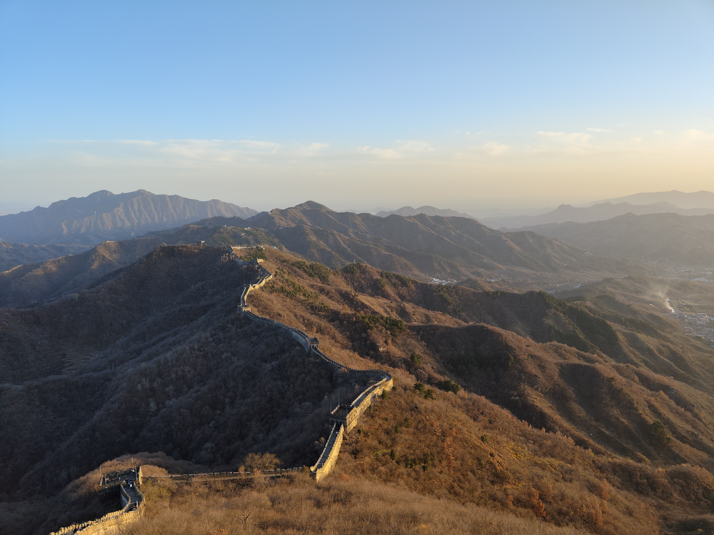
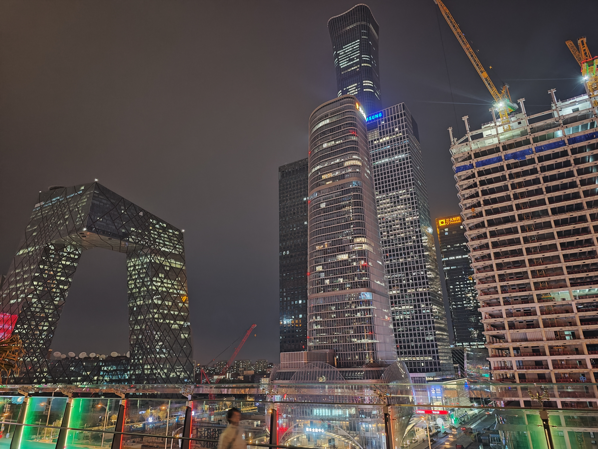
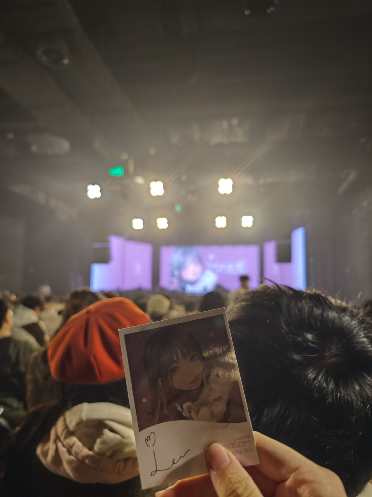
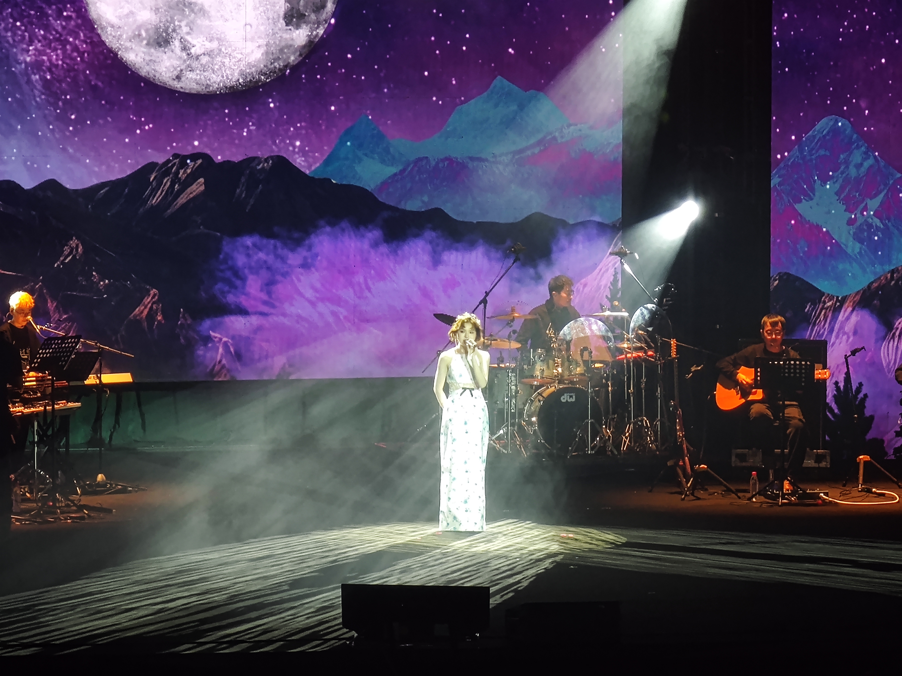
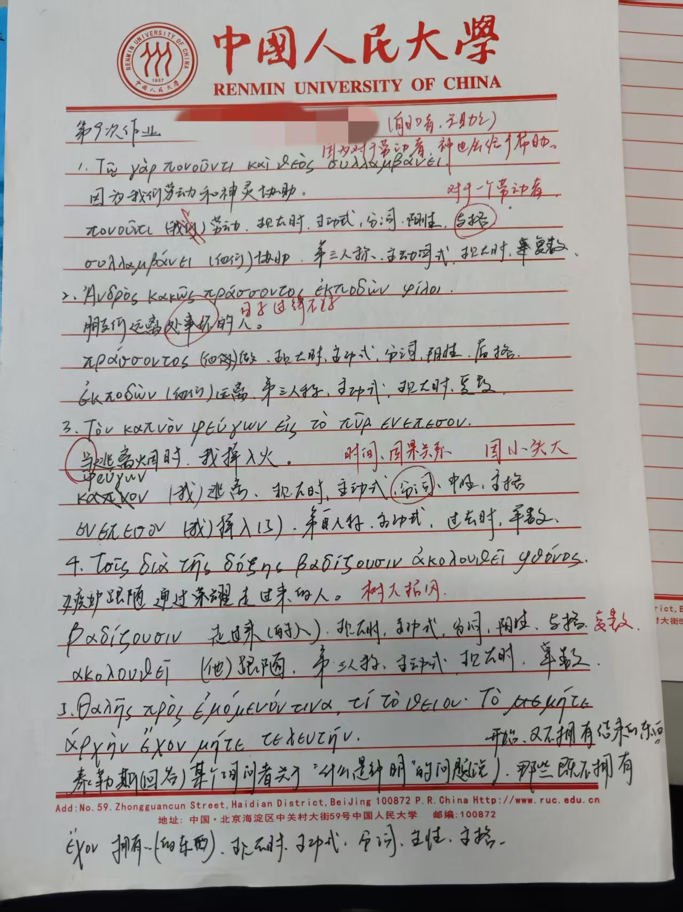

一直想写一篇文章总结一下我在鹿大的日子。刚开始是想记录第一周，后来变成了前半学期，随后是第一学期，而到现在这篇文章则负责总结我的第一学年。尽管一拖再拖，但好歹算是写了。

来到鹿大于我而言纯属意外。港大不知什么原因并没有发来offer，尽管即便发来了offer也需要我考虑一下去或不去，只是可惜了我450港币的报名费。（港大本科录取无拒信，不发offer即为未录取。）相比于与我没有任何联系的鹿大，上海某所高校在填报志愿期间以每天两个电话的频率高强度联系我并保证我的分数足以被录取，但最终仍没能达到录取分数。

这么说或许不准确，因为我实际上是达到了录取分数，但根据同分录取规则并没有拿到录取。四年前中考时也因同样原因没能考上东北师大附中，所以对这种所谓的宿命也是习惯了，也并不感到怎么遗憾。最终我去了这所非常陌生的、民间俗称“第二党校”的大学。

其实早就已经知道鹿大硬件设施极差，但我真正推开宿舍门的时候还是被完全震撼了，纯粹是锒铛入狱的感觉。六人挤在一个厕所面积的屋子里，连桌子都是两个人合用一张。其实已经毫无生活质量可言，但也只能凑合住了。

那就只能从军训开始说起。刚开始的几天强度还是比较高的，基本上都是在走分列式，天气也是很热。随后几天参观博物馆加上新生教育讲座就闲了下来，其实这还没算上我翘掉的讲座。最后几天由于走分列式太水被踢到汉字方队，一天练个两三遍，其余时间玩手机，最轻松的几天。汉字方队完全可以称得上是电竞方队。

2024.9.2 一勺池 阳光正好

军训期间值得提的还有两件事。一是全校入学后的实验班选拔，二是新生选课。实验班选拔方面，古典学项目由于考虑到就业相关而没有选择。最后报了商法班的选拔但交上简历后连面试机会都未争取到。关于实验班选拔，当时看来还比较遗憾，其实回头看觉得还是比较大坑的，尤其某些双学位项目更是如此。到我撰写本文时已经确认，商学院的商法班、营销数科班已不再面向25级学生开设，全校范围内也裁撤了许多此类项目。新生选课方面，根据小喇叭上的选课表格排雷，最后定下选课优先级和选教师优先级，挤进系统后按顺序选。其实我还比较喜欢这种无脑抢课的方案，至少不会出现按志愿选课的掉课情况，也不需要设计精密的田忌赛马方案。一个学期后我才意识到，一学期真正重要的不是听课，不是复习，也不是考试。一个学期的结果，无论是从GPA上，还是从听课的舒适度上，早在选课之时就已注定。但比较幸运的是我的第一学期选课还是比较成功的。

其实对其他人来说，军训期间还有团学组织报名、入党申请等等一系列复杂的经历，而我当时完全懒得搞这些，于是也没有相应的体验。

接下来就开始正式上课了。在鹿大的前两节课都是蹭来的。本来是计划辅修一个历史学学位，但大一上选课没有开放双选课程，于是就先自己去旁听了两节。（辅修在大二上正在提上日程。）两节课在同一个教室连续上，分别是中国古代思想文化史和中国古代政治制度史，讲的都非常好而且课程内容很硬，尤其孟xs老师在导论课上谈论的历史的使命感和历史的时代性很独到，于是这一个学期基本上都连续听完了，只是后半学期自己专业的课程忙了起来便逃掉了几节。

2024.9.9 教二2201 中国古代政治制度史课上

大一上仅仅只有两门专业课，分别是经济学原理1和管理学原理，难度都不高。由于想要早点完成培养方案对部类核心课3学分英文课的要求，选择的是英文的管理学原理课。很高兴的是选到的两位老师都很好，重点突出，PPT也会发给大家，课下也没有太多任务（如果是课下其实几乎没有任务更合理一点）。为了听这个英文的课还买了个网易有道的同传，然而翻译效果极差，用两节课以后发现还不如我自己听。

难度比较高的反而是一些公共课。思修课不必多说，只是每节课去点个到而已。大学体育排在早八，每次爬起来都非常折磨。计算机课程比较简单，参加了免修考试并通过了，但得知即便免修仍要完成两项大作业，深感其诈骗本质，便还是每周都去听课了。

要重点说说的是综合英语B和微积分C1两门。英语在开学初有个分班考试，没放水考于是分到了B班，实际上没什么意义（反而有因此拉低绩点的可能性），但教学难度确实很大，尤其是比较侧重听力和口语能力，对我这只会做阅读理解的小镇做题家来说还是比较痛苦的，尤其是期中有个集体的pre结果我背完了上去讲就疯狂忘词，好在选到的老师也比较善良。而微积分C1就是纯纯的痛苦。鹿大的经管类数学为C级，其实是相对简单的级别，但我高中数学就几乎没及格过，微积分C对我来说难度也是很大。接下来一学期绝大多数的时间都拿来做微积分的作业和习题了。刚开始还可以拿高中导数的基础撑一下，到后面开始讲中值定理就逐渐狗屁不通。

接下来是一些无聊的日常。

抽空去北大找同学玩了一天。北大确实硬件设施上比鹿大好不少，鹿大还是太破了。而且北大有燕园真的很不错，鹿大这边除了教学区就只剩下家属楼了，只有百家园、一勺池和图书馆后身的风景还不错。

2024.9.21 北京大学 博雅塔下

2024.9.21 北京大学 北门

然后闲着没事再逛逛公园。北京的很多公园确实很不错。

2024.9.24 紫竹院 绿树成荫

再贴一些在学校的日常。

在鹿大图书馆借的第一本书是弗雷泽的《金枝》。这也是我读的第一本人类学的著作。鹿大图书馆于我而言确实是十分宝贵的资源。书籍相当全，权威的和不权威的应有尽有。数据库也是很全面，而且开放给全校同学使用，不限制院系，能看爱如生、书同文还是很爽的。知网、ProQuest、Web of Science这些自然也有。

2024.9.20 鹿大校园 图书馆

国庆回来以后也就逐渐入秋了。一勺池神树还是挺夸张的，之前看《恋爱绮谭》里说华师校园有一颗爱心树在初秋首先变黄，显露出爱心的形状。鹿大这颗虽然并没有爱心的形状，但它确实是全校最早变黄的一棵树，比其他树早得多，而且是一夜之间突然变黄，以至于我一度怀疑是学校连夜喷洒脱落酸以创造奇观。

2024.10.11 鹿大校园 信息楼

2024.10.10 鹿大校园 一勺池神树

2024.10.11 鹿大校园 一勺池神树

开始期中复习了，这是当时课上记的一些笔记，字迹真的稀烂。

2024.10.25 管理学原理的一些笔记

去了一趟万圣书园，感觉选书是很不错的水平。

2024.10.26 万圣书园

紧接着是期中考试。只考微积分和英语两门。英语的题型是复合式听写、选词填空和翻译文章，难度不小，主要是复合式听写真的是我此前从未练习过的题型，临时抱佛脚了两天作用也不大，好在老师比较捞，拿了一个不算太惨的成绩。微积分这边踩线没及格，纯惨。

后半个学期照常。贴几张图在这里吧。

2024.11.21 鹿大校园 图书馆密排库

2024.11.26 慕田峪长城

2024.12.10 国贸CBD

之后去看了两场演出。KohanaLam的北京Live和双笙的经过时你我相遇演唱会。两场演出效果都很好，只是双笙这场选的北京展览馆剧场音效太差了。

2024.11.2 开花豆Live KohanaLam

2024.12.30 北展剧场 双笙“经过时你我相遇”

另外这段时间就是复习加上把第二学期的课选了。复习其实没有什么好说的，考的都还不错，微积分竟然还拿了个2.7/4，虽然可能在别人那这是看不上眼的烂分，但和我第二学期微积分C2的1.0/4比起来还是好多了。整体上考试都没有过多为难人，结合PPT复习起来还是比较轻松的，而且也要感谢这些老师讲的很好。只是体育拿了个1.7，但也没什么办法，体测成绩太烂了，一些体育老师在体测成绩上是不肯捞的。关于第二学期的选课还是照常按照选课表格排顺序，但这学期是按志愿筛选，于是我选课就相对保守，当我遇到第一志愿不能保证选上就会滑到第三志愿的情形时，我就会把原本的第二志愿作为第一志愿，真正的田忌赛马。这样做优劣都很明显，一些给分好但任务重的老师就不可避免被我选到，但他们都给分好了我还要什么自行车呢（

接着就到了第二学期。那就不得不说说这学期我选了一门古希腊语。雷lb老师讲的很好，讲课也很幽默，实际内容难度也不是很高，但对我这个铸币来说也不算简单，每节课课后作业都需要花一些时间来写，尤其到后面语法复杂起来查表都要半天，但收获也是不小的，可惜虽然这门课投入了很大精力但也没拿到4.0。微积分之类的不必多提，积分部分以后难度再次提升，这学期蹭了个1.0就已经算很不错了。英语拓展课选了一门英语国家社会与文化，真的是讲课如泡脚，考试如喝洗脚水，考的基本上都是教材的东西，但教材并不薄，内容很多，在Gemini的帮助下整理了一份复习提纲连夜看完，最后拿了4.0。其实选这门课还是很好的，只是需要做好考试周通宵复习的准备。

2025.5.6 一份古希腊语作业

这学期有三门专业课，企业战略管理、组织行为学和社会科学研究方法。其实前两门课的绝大多数内容在上学期的管理学原理课上都已经讲过了，鹿大的培养方案设计真的很不合理。但这两门课的大作业、pre还比较频繁，导致虽然没有什么实际内容但又不得不花一些精力在这里。最后还是AI整理教材加PPT连夜通关。社会科学研究方法是开卷考试，事情比较少，两次大作业，课讲的还是不错的但说实话我并没怎么听，只是学到了社会学的一些皮毛。

最需要吐槽的绝对是大作业了，我不知道这是商科特色还是所有学科都这样。大作业真的是我较大的一个负担。尽管我拖延是其中的一个方面，但我觉得大作业本身的不合理性还是很严重的。首先是内容，大作业往往给一个很开放的问题，这导致你写作业的过程中要考虑的事情越来越多，很可能考虑到后面的问题以后前面的结论就直接被后面的结论推倒，大作业免不了一个一改再改的过程。其次是格式，大作业常常会在格式上给你很多限制，需要你在MLA、APA、GB/T7714-2015等等引文格式上不断切换，还需要你去用格式刷将格式从模板上刷到自己作业上，更有甚者在行文结构上就加以限制，这种更为痛苦。最后是评价方式，开放式的问题的答案也是开放式的，于是无论你承认与否，评价方式也是极为开放的，可能你一改再改不如AI灵机一动，很多老师也并不会给出评分细则，于是分数就只能看命了。pre的频率也不低，问题大概也是上面几项，所以不再单列。大作业和微积分是第二学期压在我头上的两座大山。

关于课余生活方面，风景可以看看这两篇文章：

[一些春天](https://xzhongjie.github.io/p/一些春天/)

[夏／狂热](https://xzhongjie.github.io/p/夏狂热/)

以及去听了几场讲座，可以看看下面几篇文章：

[古籍整理及其意义的再认识](https://xzhongjie.github.io/p/古籍整理及其意义的再认识/)

[空有之间：中国古代香学小引](https://xzhongjie.github.io/p/空有之间中国古代香学小引/)

[清华简《五纪》与《尚书·洪范》类文献](https://xzhongjie.github.io/p/清华简五纪与尚书洪范类文献/)

各个学院公众号经常会推送很多很有意思的讲座，但由于课程较多导致很多讲座都没有机会去听。讲座也是大学里比较宝贵的资源，无论是通识性的讲座还是有门槛的专业讲座都很值得听，信息密度往往比正课要大很多。

另外是这个博客。4月中旬开始我有了自建博客的打算，在4月15日就已经搭建了起来。刚开始是想要Wordpress或者typecho启动的，但拖着个数据库还是太重了，组个小机器也是花销。于是最终选择了静态的博客方案，将stack主题的hugo托管在了Github pages上，自己对主题稍微做了一些修改。整体还是比较方便的，目前写博客的流程就是Typora敲好直接放到本地，再由Github Desktop直接传上去，通过Action自动部署。很神奇吧，我使用hugo但我甚至都没有在我的电脑上安装Golang的环境。具体的搭建方法如果有人有兴趣我可以单写一篇，这里不再详谈。

其他比较有趣的还有2.28的晚风里春天歌会和3.30的苏打绿草坪歌会（虽然后半部分是在室内完成的），不过忘记拍照片了。这学期确实任务比较重，主要是微积分和各门课的大作业很多，所以没怎么出去玩，这里也没有什么图片可以贴的。可能和前面文章有重复但也凑合看看吧。

2025.3.24 玉渊潭公园及中央电视台 春意正浓

2025.3.20 鹿大校园 学生活动中心后身、理工楼配楼一侧的玉兰花

2025.5.23 鹿大校园 求是园的“言叶之庭”

除此之外便没什么可以再提的了。

一学期下来对鹿大其实也没什么感受，如果非要提一点便是百花齐放。在鹿大，你能见到你觉得的那种又红又专的老师，但你听一节课便觉得爆了的老师也大有人在。学生和学风也同样是非常丰富，卷绩点的当然有，但高举“人生是旷野”旗帜的也不少。有人在忙绩点，有人在打比赛，有人在做学工，有人在PUBG启动。这样就挺好的。

2025年8月15日夜
